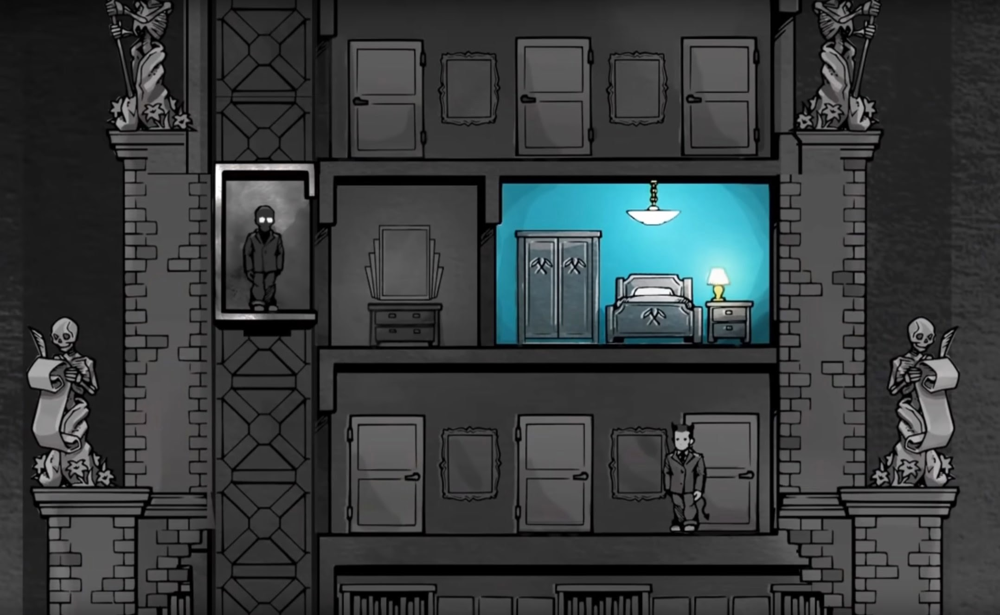

# Using Color for Clickable Items

Video game could use color to guide the player which items is interactable or not.  
This way we could guide the player so they won't lost and try to spam-clicking every items out of frustation.  

*- **Death and Taxes** using colored room to guide the player where should they go.*