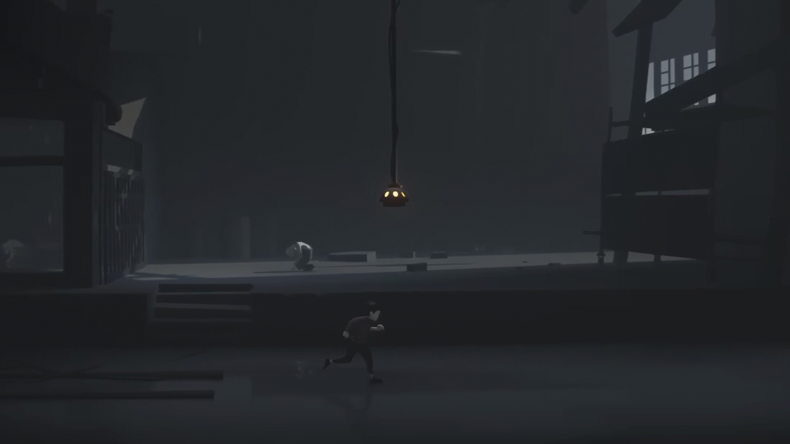
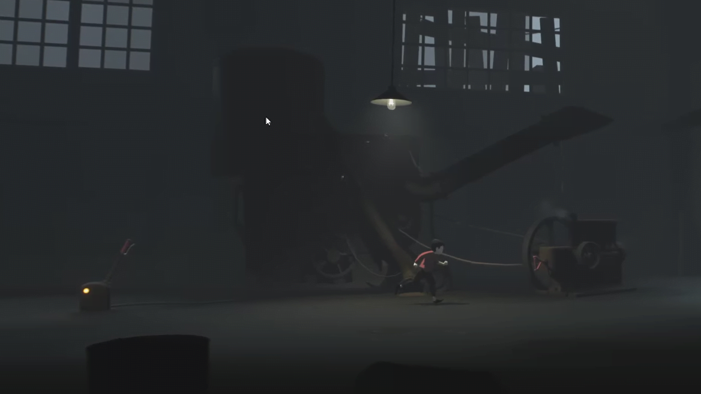
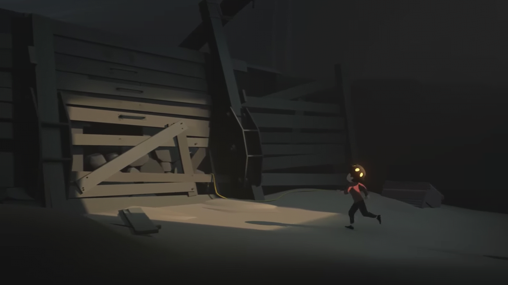

# How INSIDE use color for a hint

INSIDE is a game that use monochromatic color pallete in their game. While it's a monochromatic but that doesn't mean this game only have black and white as their color. For example, it will make a interactable item like a button on different color that popped-up compared to the surrounding. By making it has different color, it'll make the player easier to distinguish between what they can do or not, hence will make them easier to think how to solve the puzzle in this game.  

*- INSIDE using light that looks popped up and will get your attention.*

*- INSIDE have a lot of red button and lever to indicate to player that those things are interactable.*

The interesting part for me is they're using the yellow-colored cable to give a player hint that there's a hidden collectible items to collect if you follow it. This collectible items use to unlock achievement and also the "hidden ending".

*- INSIDE using yellow cable to give a hint where the collectibles are hidden.*